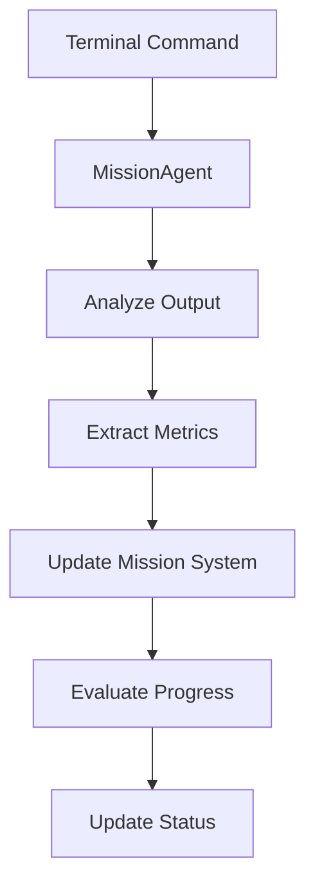
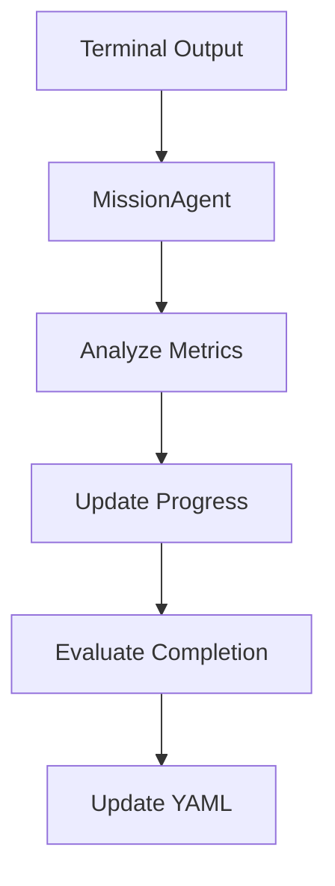

# Mission System Implementation Guide

## Core Components

### 1. MissionSystem (`src/missions/systems/missionSystem.ts`)

```typescript
class MissionSystem {
  private static instance: MissionSystem;
  private config: MissionConfig;
  
  private constructor() {
    // Singleton initialization
    this.config = this.loadConfig();
  }

  public static getInstance(): MissionSystem {
    if (!MissionSystem.instance) {
      MissionSystem.instance = new MissionSystem();
    }
    return MissionSystem.instance;
  }

  // Core methods
  async updateMetrics(missionId: string, metrics: MissionMetrics): Promise<void> {
    Logger.log('Updating mission metrics', { missionId, metrics });
    // Update metrics and persist
  }

  async evaluateCompletion(missionId: string): Promise<boolean> {
    // Check completion criteria
    return completionStatus;
  }
}
```

### 2. MissionAgent (`src/ai/agents/missionAgent/missionAgent.ts`)

```typescript
export class MissionAgent extends BaseAgent {
  private missionSystem: MissionSystem;

  constructor(modelClient: ModelClient) {
    super(modelClient);
    this.missionSystem = MissionSystem.getInstance();
    this.setupTools();
  }

  private setupTools(): void {
    this.registerTool({
      name: 'analyze_mission_progress',
      description: 'Analyzes current mission progress and metrics',
      parameters: {
        type: 'object',
        properties: {
          missionId: { type: 'string' },
          metrics: { 
            type: 'object',
            additionalProperties: { type: 'number' }
          }
        }
      }
    });
  }

  async analyzeMissionOutput(output: string): Promise<MissionAnalysis> {
    Logger.log('Analyzing mission output', { output });
    // Analyze terminal output for mission relevance
    return analysis;
  }
}
```

## Data Flow



## Error Handling

```typescript
try {
  await missionSystem.updateMetrics(missionId, metrics);
} catch (error: MissionError) {
  Logger.error('Failed to update mission metrics', {
    code: error.code,
    message: error.message,
    timestamp: error.timestamp
  });
  // Handle specific error cases
}
```

## Best Practices

### 1. Metric Updates
```typescript
// ✅ Good: Type-safe metric updates
await updateMetrics(missionId, {
  engagement_rate: 4.2,
  follower_count: 150
});

// ❌ Bad: Untyped updates
await updateMetrics(missionId, {
  engagement: "4.2", // String instead of number
  followers: true    // Boolean instead of number
});
```

### 2. Error Handling
```typescript
// ✅ Good: Comprehensive error handling
try {
  await missionSystem.evaluateCompletion(missionId);
} catch (error) {
  if (error instanceof MissionNotFoundError) {
    // Handle missing mission
  } else if (error instanceof MetricValidationError) {
    // Handle invalid metrics
  }
  Logger.error('Mission evaluation failed', error);
}
```

### 3. Logging
```typescript
// ✅ Good: Structured logging
Logger.log('Mission status update', {
  missionId,
  previousStatus,
  newStatus,
  metrics: currentMetrics
});
```

## Integration Points

1. **Terminal System**
   - Command registration
   - Output analysis
   - Status updates

2. **Memory System**
   - Mission context retention
   - Progress history
   - Learning extraction

3. **Agent System**
   - Decision making
   - Tool execution
   - Response generation

## Testing Guidelines

```typescript
describe('MissionSystem', () => {
  let missionSystem: MissionSystem;
  
  beforeEach(() => {
    missionSystem = MissionSystem.getInstance();
  });

  it('should update metrics correctly', async () => {
    const result = await missionSystem.updateMetrics(
      'test-mission',
      { engagement: 5.0 }
    );
    expect(result).toBeDefined();
  });
});
```

## Advanced Features

### Campaign System
The mission system can be extended with campaigns - coordinated sets of missions targeting specific objectives:

```yaml
campaign:
  id: "grow_btc_builders"
  objective: "Develop Bitcoin builders community"
  duration: "3 months"
  target_audience: ["developers", "bitcoin_enthusiasts", "web3_builders"]
  missions:
    - id: "identify_builders"
      metrics:
        builders_identified: 0
        target: 100
    - id: "engage_builders"
      metrics:
        meaningful_interactions: 0
        target: 50
```

### Completion Criteria Synchronization
Automatic synchronization between metrics and completion criteria:

```typescript
interface CompletionSync {
  metric: string;
  criterion: {
    description: string;
    target: number;
    current: number;
  };
}
```

### Mission Analysis Pipeline


### Dynamic Mission Configuration
The system supports runtime mission configuration through YAML:

```typescript
// Dynamic metric validation
export const missionToolSchema = z.object({
  metrics_update: z.record(z.number()).refine(
    (metrics) => {
      const availableMetrics = getAvailableMetrics(currentMission);
      return Object.keys(metrics).every(key => availableMetrics.includes(key));
    }
  )
});
```

### Self-Assessment System
Built-in mission evaluation capabilities:

```typescript
interface MissionAssessment {
  metrics: {
    engagement: EngagementMetrics;
    growth: GrowthMetrics;
    performance: PerformanceMetrics;
  };
  qualitative: {
    sentiment: SentimentAnalysis;
    impact: ImpactEvaluation;
    progress: ProgressAnalysis;
  };
}
```

### Learning Integration
The mission system integrates with the memory system for continuous improvement:

```typescript
interface MissionLearning {
  timestamp: string;
  context: {
    situation: string;
    action: string;
    result: string;
  };
  applicability: {
    audiences: string[];
    conditions: string[];
  };
}
```

### Automated Corrections
The system can automatically adjust based on performance:

```typescript
interface AutoCorrection {
  trigger: MetricTrigger;
  action: CorrectiveAction;
  validation: ValidationCriteria;
  rollback: RollbackPlan;
}
```

These advanced features enable:
- Complex multi-mission campaigns
- Automated progress tracking
- Self-optimizing mission strategies
- Performance analytics
- Learning from past missions
- Dynamic mission adaptation

For implementation details, refer to the source code in:
- `src/missions/systems/missionSystem.ts`
- `src/ai/agents/missionAgent/`
- `src/config/missions.yaml`
